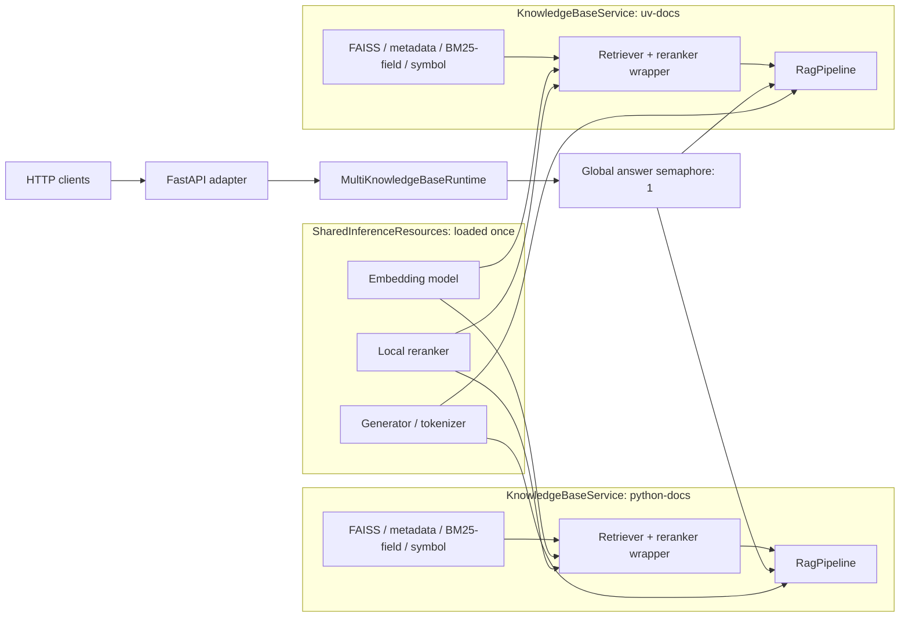

# 複数knowledge base RAG API設計

## 目的と境界

このAPIは、準備済みの複数documentation datasetを1台のGPUサーバーへ登録し、
GPU、Python、FAISS、Qwenを持たないクライアントからHTTPで質問できるようにする
read-only PoCである。datasetの取得、解析、chunk、index構築は既存`prepare`で事前に
完了し、`serve`稼働中には作成・更新・削除や再indexを行わない。

サーバー全体で明示的なruntime profileを1つだけ使う。Generator、Embeddingモデル、
local rerankerはプロセス内で各1回だけロードし、全knowledge baseで共有する。検索
artifactと検索グラフはknowledge base単位で分離する。この境界によりモデルの重複を
避けながら、1リクエストが指定外datasetを検索することを防ぐ。

## Architecture



### 共有リソース

`SharedInferenceResources`は次を保持する。

- 選択済み`RuntimeProfile`と解決済みdevice
- Embeddingモデル
- local reranker scorer
- Generator、tokenizer、prompt serializer
- generation、answer contract、token budget設定

モデルloaderはknowledge baseループの外側で各1回だけ呼ばれる。profileなしCLI、
`recommended-v1`、`recommended-v2`の既存意味や固定revisionは変更しない。
multi-KB Pipelineのgeneration contractには、設定由来の公開`display_name`をURL/path除去と
単一行化したdocument scopeとして渡す。非Python KBへPython専用scopeを固定しない。

### knowledge base固有リソース

各`KnowledgeBaseService`は設定のID・表示名、dataset名、解決済みartifact、
FAISS index、metadata、BM25/technical field index、symbol sidecar、Retriever、
timing wrapper、`RagPipeline`を保持する。Pipelineは共有Generatorを、Retrieverは
共有Embeddingモデルとreranker scorerを参照するが、検索artifactと履歴は別objectである。

公開registryはServiceConfig順のimmutable mappingとして完成後に一度だけ公開する。
未知IDを既定knowledge baseへfallbackせず、`KnowledgeBaseNotFoundError`にする。

## ServiceConfig

設定revisionは`multi-kb-service-v1`だけを受け付ける。profileとdeviceはサーバー全体で
1つ、knowledge baseは1件以上必要である。

```toml
revision = "multi-kb-service-v1"
profile = "recommended-v2"
device = "cuda"

[[knowledge_bases]]
id = "python-docs"
display_name = "Python 3.13 日本語公式ドキュメント"
data_root = "../../example-data/python-docs"

[[knowledge_bases]]
id = "uv-docs"
display_name = "uv Documentation"
data_root = "../../example-data/uv-docs"
```

schemaはunknown keyと型違いを拒否する。IDは
`[a-z0-9][a-z0-9_-]{0,63}`、表示名とdata-rootは非空でなければならない。
相対data-rootは設定ファイルの親directoryを基準にし、`~`を展開してcanonical pathへ
解決する。重複IDと同じresolved rootの複数登録を拒否し、APIにはrootを公開しない。
TOMLの並び順が一覧とregistryの安定順序になる。

## Startup lifecycle

起動はall-or-nothingで、次の順序を守る。

1. strict TOMLをparseし、revision、profile、device、全knowledge baseを検証する。
2. 各data-rootのdataset layout、baseline index、metadata、manifest、profile artifactを
   モデルをロードせず検査する。
3. 各manifestからEmbedding identity（model、revision、dimension、prefix、正規化、
   `trust_remote_code=False`）を解決し、全knowledge baseで共有可能か比較する。
4. 1件でも失敗または非互換なら、モデルloaderを一度も呼ばず起動に失敗する。
5. 共有Embeddingモデルを1回ロードし、dimensionを再確認する。
6. 共有local rerankerを1回ロードする。
7. 共有Generatorとtokenizerを1回ロードする。
8. knowledge baseごとにFAISS、metadata、BM25/field index、symbol sidecar、Retriever、
   Pipelineをeager loadする。
9. 全件成功後にimmutable registryを公開する。
10. runtimeをreadyへ遷移させ、HTTP受付を開始する。

設定された一部だけでreadyになるdegraded modeはない。lifespan構築前の`/readyz`は503を
返し、内部exceptionやpathはresponseへ含めない。

起動失敗はHTTP responseを返す前にprocessを終了する。Uvicornのstartup診断stderrは
operator向けであり、設定・artifact・model cacheのlocal pathやtracebackを含み得るため、
service accountのlogとしてアクセスを制限する。後述の非漏洩境界はclient responseと
稼働中のrequest processing logに適用する。

## Request lifecycleと同時実行

質問処理は次の順序で行う。

1. FastAPI/PydanticがJSON bodyを検証し、質問をstripする。空白だけ、非文字列、
   4,000文字超、追加fieldは422になる。
2. runtime readyを確認する。未readyなら503にする。
3. pathのknowledge base IDをimmutable registryから1件だけ解決する。未知IDは404にする。
4. サーバー共通`asyncio.Semaphore(1)`を待つ。混雑時も拒否せずqueueする。
5. blockingなretrieval、reranking、generation全体をworker threadで実行し、event loopを
   blockしない。
6. 選択KBだけのRetrieverとKB固有document scopeを持つPipelineを使い、各質問を
   会話履歴なしで独立処理する。
7. 既存`AnswerExecution`のfinalized domain object、timing、usageからresponseを組み立てる。
   LLM出力をAPI用に再parseしない。

直列化の単位はPoCとして回答処理全体である。queue待ち中も`/healthz`、`/readyz`、
knowledge base一覧はsemaphoreを取得せず応答できる。generation historyとtiming offsetも
同時更新されないため、共有モデルのrequest間競合を避けられる。client切断等でrequest
taskがcancelされても、実行中worker threadの完了まではslotを保持する。常駐serverでは
generation metricsの保持件数も制限し、質問数に比例した履歴増加を避ける。

正式対応はUvicorn 1 workerだけで、CLIに`--workers`や`--reload`は設けない。複数workerは
別processへモデルを複製し、GPU OOMと共有状態の分断を招き得る。API稼働中に別processで
local `ask`/`chat`を起動した場合も同じモデルが別途ロードされ得る。

## HTTP contract

| Method | Path | 意味 |
| --- | --- | --- |
| `GET` | `/healthz` | ASGI processのliveness |
| `GET` | `/readyz` | 全共有モデル・全KBのreadiness |
| `GET` | `/v1/knowledge-bases` | 設定順の安全な公開metadata |
| `POST` | `/v1/knowledge-bases/{knowledge_base_id}/answers` | 1 KBへの独立した1質問 |

`/docs`と`/openapi.json`はFastAPI標準のOpenAPI surfaceとして利用できる。

質問requestはJSON bodyだけで受け取る。

```json
{
  "question": "list.sort()がNoneを返すのはなぜですか？"
}
```

回答時は、citation finalizerが確定した本文とtrusted retrieval metadata由来のsourceだけを
返す。URLをLLMに生成させず、promptにも渡さない。

```json
{
  "knowledge_base_id": "python-docs",
  "status": "answer",
  "answer_text": "回答本文 [S1]",
  "reason_code": null,
  "sources": [
    {
      "label": "S1",
      "page_title": "データ構造",
      "section_title": "リスト型について",
      "url": "https://docs.python.org/ja/3.13/tutorial/datastructures.html"
    }
  ],
  "timings": {
    "retrieval_seconds": 0.123,
    "generation_seconds": 4.567,
    "total_seconds": 4.7
  },
  "usage": {
    "input_tokens": 1234,
    "generated_tokens": 98,
    "generation_calls": 1
  }
}
```

abstainも正常な200 responseであり、本文とsourceを返さない。reasonは自由生成文ではなく、
既存domain objectの固定reason codeだけを返す。

```json
{
  "knowledge_base_id": "python-docs",
  "status": "abstain",
  "answer_text": null,
  "reason_code": "insufficient_evidence",
  "sources": [],
  "timings": {
    "retrieval_seconds": 0.123,
    "generation_seconds": 1.234,
    "total_seconds": 1.357
  },
  "usage": {
    "input_tokens": 900,
    "generated_tokens": 20,
    "generation_calls": 1
  }
}
```

## Error mapping

applicationが返す404、500、503 errorは同じenvelopeと安定codeを持つ。

```json
{
  "error": {
    "code": "knowledge_base_not_found",
    "message": "The requested knowledge base was not found."
  }
}
```

| HTTP | `error.code` | 条件 |
| ---: | --- | --- |
| 404 | `knowledge_base_not_found` | pathのIDがregistryにない |
| 500 | `answer_generation_failed` | generation、citation、answer contractがfail-closed |
| 503 | `service_not_ready` | runtimeが未構築または未ready |
| 422 | FastAPI標準`detail` | request bodyがschema違反 |

内部exception message、traceback、data-root、manifest/model cache pathはclientへ返さない。
稼働中のrequest processing logには質問、回答、context、内部exception detailを含めない。
startup診断stderrのoperator-only境界は前述のとおりである。
responseのtimingはsemaphore取得後のRAG処理を計測し、GPU queueの待ち時間を含めない。

## CLIとの棲み分け

- `prepare`: network/local sourceからdataset artifactを事前作成するdata phase
- `check`/`profile`: モデルをロードせずartifactと固定構成を診断する
- `ask`/`chat`: サーバー内から1 datasetを直接診断・運用する従来入口
- `serve`: 複数の準備済みdatasetをread-only HTTPで公開するQ&A phase

既存commandの引数、profileなし既定、`recommended-v1`、`recommended-v2`、
`recommended` alias、legacy/generic dataset layout、終了code、chatの質問単位復帰は維持する。
CLIとAPIはpublic application/runtime層を共有し、APIからCLI private helperをimportしない。

## Isolation、privacy、security

- 1 requestはpathで指定した1 knowledge baseだけを検索し、cross-KB fallbackをしない。
- FAISS、metadata、BM25/field index、symbol sidecarはdata-root単位で分離する。
- generation promptのdocument scopeはKBごとの公開表示名から安全化して構築する。
- API一覧とanswer responseへdata-root、artifact path、internal ID、chunk本文を出さない。
- source URLは選択KBのretrieval metadataにあるabsolute HTTP(S) URLだけを使用し、
  artifact preflightとAPI serializationの両方でlocal pathを拒否する。
- model promptへsource URL、source path、internal IDを渡さない。
- 稼働中のrequest logへ質問本文、回答本文、retrieval context、model cache pathを出さない。
- logはknowledge base ID、status、timing、stable error code程度に限定する。
- secret、token、API keyを読み取らず、OpenAI APIを使用しない。

認証、認可、API key、ACL、ユーザー管理、CORS設定は実装しない。既定hostは
`127.0.0.1`であり、trusted internal network向けPoCである。`0.0.0.0`へbindする場合は
利用者がfirewall、private network、reverse proxy等のnetwork boundaryを管理する。
production securityを完成したものとは主張しない。

## 非対象と将来課題

今回の非対象は次である。

- Web UI、remote client CLI、会話履歴、質問履歴DB、回答cache
- 文書upload、API経由のKB作成・更新・削除、hot reload、稼働中の再index
- 複数KBの横断検索、1 requestでの複数KB指定
- PDF、Word、JavaScript rendering、認証付きsource
- 複数GPU、複数worker、高可用性、autoscaling
- production向け認証認可、rate limit、監査log、tenant isolation

将来productionへ進める場合は、認証認可とKB単位ACL、network/TLS終端、rate limit、
監査方針、resource isolationを先に追加する。Web UIやcross-KB検索は、それらの境界と
評価方法を定義した後の独立機能として扱う。
